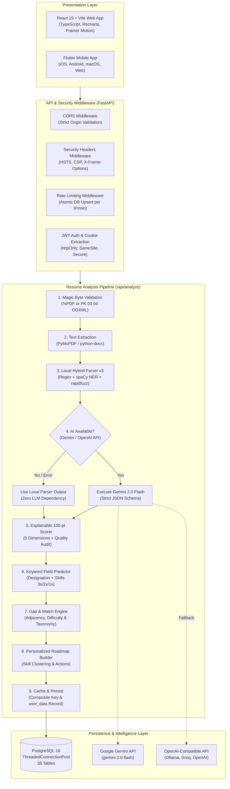
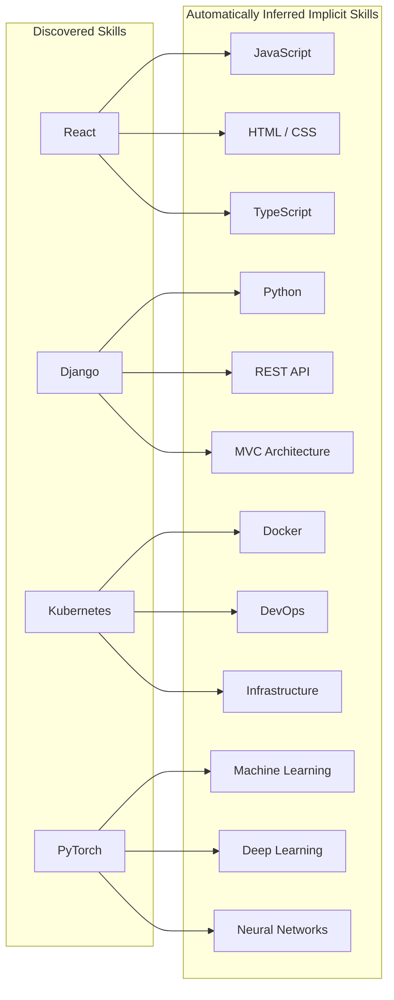
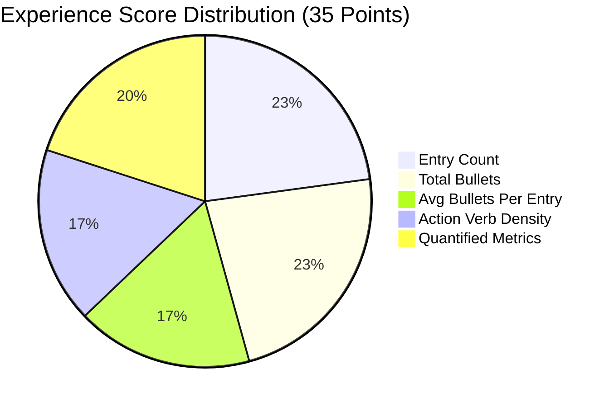
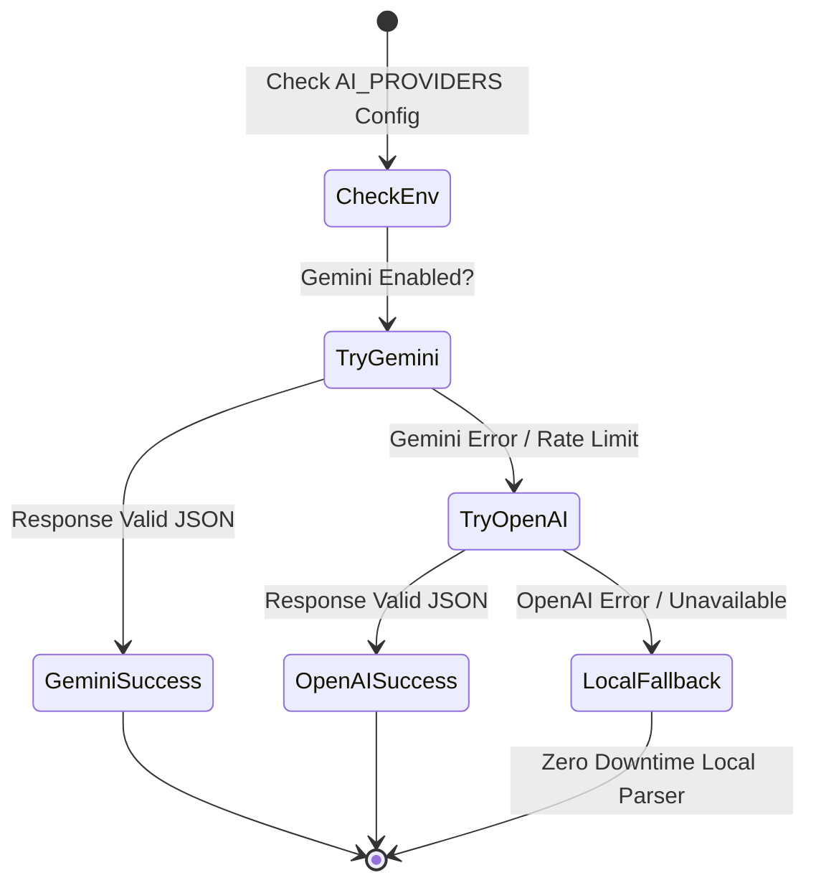
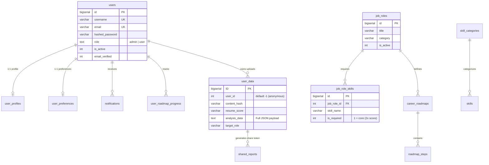
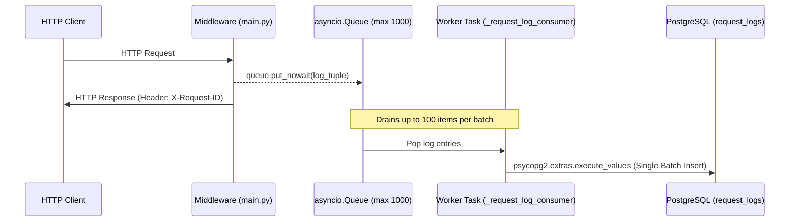

# How SkillPath Works: Deep-Dive System Architecture & Explicit Engines

> **Document Version:** 3.0  
> **System Scope:** Full-Stack Architecture (FastAPI, React 19, Flutter Mobile, PostgreSQL 16)  
> **Core Focus:** In-depth mechanics of the resume parsing engine, rule-based algorithms, deterministic fallbacks, explicit scoring logic, and end-to-end data lifecycle.

---

## Table of Contents

1. [Executive Summary & Architectural Philosophy](#1-executive-summary--architectural-philosophy)
2. [End-to-End System Architecture](#2-end-to-end-system-architecture)
3. [The Resume Parsing Engine (Deep Dive)](#3-the-resume-parsing-engine-deep-dive)
   - 3.1 [File Ingestion, Magic Byte Checks & Security](#31-file-ingestion-magic-byte-checks--security)
   - 3.2 [Text Extraction Layer (PyMuPDF & python-docx)](#32-text-extraction-layer-pymupdf--python-docx)
   - 3.3 [Local Hybrid Parser v3 Pipeline](#33-local-hybrid-parser-v3-pipeline)
   - 3.4 [Section Boundary Detection State Machine](#34-section-boundary-detection-state-machine)
   - 3.5 [Entity Extraction (Contact Info & Candidate Name)](#35-entity-extraction-contact-info--candidate-name)
   - 3.6 [Fuzzy Skill Extraction & Multi-Gram Tokenization](#36-fuzzy-skill-extraction--multi-gram-tokenization)
   - 3.7 [Semantic Skill Inference Graph Engine](#37-semantic-skill-inference-graph-engine)
   - 3.8 [Experience Block Extraction Algorithm](#38-experience-block-extraction-algorithm)
   - 3.9 [Education Block Extraction Algorithm](#39-education-block-extraction-algorithm)
   - 3.10 [Deterministic Parser Confidence Scoring](#310-deterministic-parser-confidence-scoring)
4. [Scoring, Gap Analysis & Matching Engines](#4-scoring-gap-analysis--matching-engines)
   - 4.1 [100-Point Explainable Resume Score Breakdown](#41-100-point-explainable-resume-score-breakdown)
   - 4.2 [Experience Quality Scoring Dimensions](#42-experience-quality-scoring-dimensions)
   - 4.3 [Role Match Score Formula](#43-role-match-score-formula)
   - 4.4 [Candidate Ranking Algorithm](#44-candidate-ranking-algorithm)
   - 4.5 [Job Description Keyword Gap Analyzer](#45-job-description-keyword-gap-analyzer)
   - 4.6 [Deterministic Field Prediction Algorithm](#46-deterministic-field-prediction-algorithm)
5. [Roadmap Generation & Career Progression Engine](#5-roadmap-generation--career-progression-engine)
   - 5.1 [Skill Gap Prioritization Logic](#51-skill-gap-prioritization-logic)
   - 5.2 [Coherent Skill Clustering](#52-coherent-skill-clustering)
   - 5.3 [Phase & Duration Estimation](#53-phase--duration-estimation)
   - 5.4 [Role-Specific Project Suggestions](#54-role-specific-project-suggestions)
   - 5.5 [Zero-Gap Mastery Roadmap Generation](#55-zero-gap-mastery-roadmap-generation)
6. [AI Provider Hierarchy & Fallback System](#6-ai-provider-hierarchy--fallback-system)
   - 6.1 [Google Gemini Provider (Structured JSON Schema)](#61-google-gemini-provider-structured-json-schema)
   - 6.2 [OpenAI-Compatible Generic Provider](#62-openai-compatible-generic-provider)
   - 6.3 [Rule-Based Fallback Resume Rewriter](#63-rule-based-fallback-resume-rewriter)
   - 6.4 [Cover Letter Generator & Identity Security Guard](#64-cover-letter-generator--identity-security-guard)
7. [Database Architecture & Data Persistence](#7-database-architecture--data-persistence)
   - 7.1 [Database Engine & Connection Pool](#71-database-engine--connection-pool)
   - 7.2 [Core Table Topology & Relationship Schema](#72-core-table-topology--relationship-schema)
   - 7.3 [Composite Keys, Partial Indexes & Deferrable Triggers](#73-composite-keys-partial-indexes--deferrable-triggers)
   - 7.4 [Analysis Caching & Cache Invalidation Strategy](#74-analysis-caching--cache-invalidation-strategy)
8. [Security, Authentication & Operations](#8-security-authentication--operations)
   - 8.1 [Dual-Token JWT Architecture & Cookie Transport](#81-dual-token-jwt-architecture--cookie-transport)
   - 8.2 [Bcrypt Password Hashing with 72-Byte Truncation Guard](#82-bcrypt-password-hashing-with-72-byte-truncation-guard)
   - 8.3 [Sliding-Window Atomic Database Rate Limiter](#83-sliding-window-atomic-database-rate-limiter)
   - 8.4 [Asynchronous Batch Request Logging Pipeline](#84-asynchronous-batch-request-logging-pipeline)
   - 8.5 [Brute-Force Account Lockout & OTP Verification](#85-brute-force-account-lockout--otp-verification)
9. [Scrapers & Market Simulation Engine](#9-scrapers--market-simulation-engine)
   - 9.1 [Live Coursera Card Scraper](#91-live-coursera-card-scraper)
   - 9.2 [Market Shift Simulation Engine](#92-market-shift-simulation-engine)
10. [Client Applications: Web (React 19) & Mobile (Flutter)](#10-client-applications-web-react-19--mobile-flutter)
    - 10.1 [Web Client Architecture](#101-web-client-architecture)
    - 10.2 [Cross-Platform Mobile App (Flutter)](#102-cross-platform-mobile-app-flutter)
11. [Testing & Quality Assurance Framework](#11-testing--quality-assurance-framework)

---

## 1. Executive Summary & Architectural Philosophy

**SkillPath** is a production-grade career development platform that performs deep parsing of resumes, extracts skills and professional trajectories, matches candidates against industry roles, computes explainable resume scores, detects skill gaps, and generates personalized learning roadmaps.

### The Hybrid Architecture Philosophy
Many modern applications delegate all core reasoning to external LLMs (such as Google Gemini or OpenAI). SkillPath was engineered under a fundamentally different design philosophy:

```
┌────────────────────────────────────────────────────────────────────────────┐
│                        HYBRID ARCHITECTURE PRINCIPLE                       │
├────────────────────────────────────────────────────────────────────────────┤
│ 1. Deterministic First: Core parsing, extraction, scoring, gap analysis,   │
│    and roadmap generation have complete, self-contained rule engines      │
│    written explicitly in Python.                                           │
│ 2. AI as an Enhancement: LLMs provide natural-language polish and         │
│    contextual synthesis, but the system functions with 100% feature        │
│    completeness even when LLM keys are absent, offline, or rate-limited.   │
│ 3. Explainability over Black-Box Output: All scores (0-100) are broken     │
│    down into explicit point formulas with granular evidence strings.       │
│ 4. Strict Zero-Trust Data Boundaries: Personal identity data is locked     │
│    to authenticated profile state and never spoofed by parsed text.        │
└────────────────────────────────────────────────────────────────────────────┘
```

---

## 2. End-to-End System Architecture

The following diagram details the complete data flow across the presentation, application, database, and intelligence layers:



---

## 3. The Resume Parsing Engine (Deep Dive)

The parsing engine is located in [`api/resume_parser.py`](file:///Users/theanix/downloads/skillpath/api/resume_parser.py), [`api/parser_enhancements.py`](file:///Users/theanix/downloads/skillpath/api/parser_enhancements.py), [`api/resume_patterns.py`](file:///Users/theanix/downloads/skillpath/api/resume_patterns.py), and [`api/extractor.py`](file:///Users/theanix/downloads/skillpath/api/extractor.py). It operates entirely locally using deterministic regex patterns, NLP tokenizers, fuzzy string metrics, and a semantic graph.

### 3.1 File Ingestion, Magic Byte Checks & Security

When a resume is submitted to `POST /api/analyze`, the payload undergoes three explicit safety verifications before any extraction library touches the file:

```python
# From api/routes/analysis.py
MAX_FILE_SIZE = 5 * 1024 * 1024  # 5 MiB ceiling
PDF_MAGIC = b"%PDF"
ZIP_MAGIC = b"PK\x03\x04"
```

1. **Size Enforcement:** If `len(contents) > MAX_FILE_SIZE`, the API immediately raises an HTTP 413 error to prevent memory exhaustion attacks.
2. **Magic Byte Verification:** The file extension is completely ignored. The engine inspects the raw leading binary bytes:
   - If bytes start with `%PDF` (`0x25 0x50 0x44 0x46`), it is flagged as PDF.
   - If bytes start with `PK\x03\x04` (`0x50 0x4B 0x03 0x04`), it is inspected as a ZIP package.
3. **OOXML Archive Deep-Inspection:**
   Many malicious files or non-document formats (such as `.xlsx`, `.jar`, `.apk`, or plain `.zip` archives) share the `PK\x03\x04` header. The system explicitly inspects the internal member table:
   ```python
   with zipfile.ZipFile(io.BytesIO(contents)) as z:
       names = set(z.namelist())
   if "[Content_Types].xml" in names and "word/document.xml" in names:
       return "docx"
   return None
   ```
4. **POSIX Permission Lockdown:** The file is written into an isolated temporary directory created with `tempfile.NamedTemporaryFile` and immediately locked down with `os.chmod(tmp.name, 0o600)` (read/write restricted solely to the application user).

### 3.2 Text Extraction Layer (PyMuPDF & python-docx)

Text extraction is handled cleanly per file type in [`api/extractor.py`](file:///Users/theanix/downloads/skillpath/api/extractor.py):

- **PDF Files (`extract_text_from_pdf`):** PyMuPDF (`fitz`) opens the file handle and iterates page by page:
  ```python
  doc = fitz.open(pdf_path)
  text = "".join(page.get_text() + "\n" for page in doc)
  doc.close()
  ```
- **DOCX Files (`extract_text_from_docx`):** `python-docx` unpacks the XML DOM and iterates through all body paragraphs, capturing only non-empty strings.

If the returned text is empty or only whitespace, a `ResumeParseException` is raised immediately, halting downstream processing.

---

### 3.3 Local Hybrid Parser v3 Pipeline

The local parser (`parse_resume_fallback` in [`api/resume_parser.py`](file:///Users/theanix/downloads/skillpath/api/resume_parser.py)) transforms raw unstructured text into a fully qualified resume object without any external network requests.

```
RAW RESUME TEXT
  │
  ├── 1. Line Normalization & Tokenization
  │
  ├── 2. Section Boundary Detection (8 Canonical Sections)
  │
  ├── 3. Contact & Name Extraction (spaCy PERSON NER + Regex Heuristics)
  │
  ├── 4. Fuzzy Skill Extraction (Rapidfuzz 1-3 grams + Stoplist)
  │
  ├── 5. Semantic Skill Inference Graph Expansion
  │
  ├── 6. Experience Parser (Dateutil boundary scan, backward/forward scan)
  │
  ├── 7. Education Parser (Degree negative lookaround + year extraction)
  │
  ├── 8. Organization & Title Extraction (spaCy ORG + title keywords)
  │
  ├── 9. Gap Analysis & Role Match Calculation
  │
  └── 10. Confidence Score Computation (0-100)
```

---

### 3.4 Section Boundary Detection State Machine

Resumes format headers in wildly divergent ways (e.g., `• WORK EXPERIENCE:`, `PROFESSIONAL BACKGROUND`, `1. Education`). The system standardizes this with an explicit boundary detection algorithm:

```python
# Canonical section priority order
_SECTION_ORDER = [
    "summary", "experience", "education", "skills",
    "projects", "certifications", "languages", "awards"
]
```

#### The Detection Algorithm (`_detect_section`):
1. **Cleaning:** Strips leading bullet characters (`•`, `·`, `-`, `*`, `▪`, `►`, `▸`, `→`) and trailing delimiters (`:`, `.`, `,`, `;`).
2. **Length Guard:** If the cleaned line is empty or exceeds **40 characters**, it is rejected as a section header. This prevents standard narrative paragraphs from accidentally triggering section transitions.
3. **Word-Boundary Matching:** Tests the line against regular expressions bounded by `\b{header}\b` across more than 45 header variants defined in `SECTION_HEADERS`.
4. **State Machine Partitioning:** As lines are evaluated sequentially, the active `current_section` buffer receives incoming lines until a new header triggers a state shift. Content appearing before any recognizable header is captured for candidate name and contact analysis.

---

### 3.5 Entity Extraction (Contact Info & Candidate Name)

Contact information and identities are extracted using deterministic rules:

- **Email Address:** Extracted using regex `[\w.+-]+@[\w.-]+\.\w+`.
- **LinkedIn Profile:** Extracted using `linkedin\.com/in/[\w-]+`.
- **GitHub Profile:** Extracted using `github\.com/[\w-]+`.
- **Phone Number (`_tighten_phone`):**
  Uses a multi-segment regex capturing optional international country codes `(?:\+?\d{1,3}[\s.\-]?)?`, parenthesized area codes `(?:\(\d{2,4}\)|\d{2,4})`, and line digits:
  - Normalizes candidate matches by stripping non-digit characters.
  - Accepts numbers strictly within **10 to 15 digits**.
  - Rejects 4-digit strings (preventing graduation years like `2020` from being identified as phones).
  - Selects numbers containing `+` or parentheses `(` over plain digit sequences.
- **Candidate Name Detection (`_detect_name`):**
  - **Tier 1 (spaCy NER):** Evaluates the first 10 lines of the resume using `en_core_web_sm`. Looks for entities labeled `PERSON`. Rejects any candidate containing digits, strings under 3 characters, or matching section keywords (e.g., "Summary", "Objective").
  - **Tier 2 (Deterministic Regex Fallback):** If spaCy is uninstalled or finds nothing, it scans the first 5 lines for a string that:
    1. Does not match `NOISE_LINE_RE` (`resume`, `curriculum`, `vitae`, `email`, `tel:`, `@`, `http`).
    2. Contains between **2 and 4 words**.
    3. Has every word starting with an uppercase letter (`w[0].isupper()`).
    4. Contains zero numbers.
    5. Does not match any section title.

---

### 3.6 Fuzzy Skill Extraction & Multi-Gram Tokenization

Standard regex keyword matching fails when candidates write "ReactJS", "k8s", "Postgres", or "ML". SkillPath solves this with a multi-gram tokenization and fuzzy matching engine in [`api/parser_enhancements.py`](file:///Users/theanix/downloads/skillpath/api/parser_enhancements.py):

1. **Tokenization into N-Grams:**
   The resume text is tokenized into word units `[a-z0-9+#\.]+`. It generates:
   - **Unigrams:** Single words (e.g., `docker`, `python`).
   - **Bigrams:** Two-word sliding windows (e.g., `spring boot`, `machine learning`).
   - **Trigrams:** Three-word sliding windows (e.g., `amazon web services`, `natural language processing`).
2. **Noise Filtration (`_NOISE_SKILLS`):**
   Generic technical noise and acronyms are explicitly filtered out, preventing false matches on words like `c`, `r`, `go`, `cpu`, `gpu`, `ui`, `ux`, `os`, `api`, `jwt`, `xml`, `json`, `png`, `svg`.
3. **Rapidfuzz WRatio Matching:**
   Each candidate multi-gram is evaluated against canonical taxonomy keys using `rapidfuzz.process.extractOne` with `fuzz.WRatio`.
   - **Similarity Cutoff:** Strict **85%** threshold.
   - Matches are mapped back to canonical taxonomy terms (e.g., candidate token "react.js" matches canonical "React").
4. **Canonical Alias Mapping (`_SKILL_ALIASES`):**
   A static map of over 70 explicit technology aliases standardizes spelling variations:
   - Languages: `"js"` → `"javascript"`, `"ts"` → `"typescript"`, `"py"` → `"python"`, `"c sharp"` → `"c#"`.
   - Cloud & DevOps: `"k8s"` → `"kubernetes"`, `"tf"` → `"terraform"`, `"prom"` → `"prometheus"`.
   - Data & AI: `"ml"` → `"machine learning"`, `"dl"` → `"deep learning"`, `"tf"` / `"keras"` → `"tensorflow"`.

---

### 3.7 Semantic Skill Inference Graph Engine

Candidates frequently list high-level tools without explicitly specifying the foundational technologies they imply. SkillPath features an explicit inference graph `SKILL_INFERENCE_GRAPH` with over 60 direct technology mapping nodes:



The expansion engine (`infer_implicit_skills`) checks both exact matches and partial substring matches (e.g., `"React Native"` triggers the `"React"` graph node), appending non-duplicate inferred skills in title case.

---

### 3.8 Experience Block Extraction Algorithm

Extracting structured work history without an LLM is a complex challenge. SkillPath implements an explicit 4-step boundary and backward/forward scanning algorithm (`_parse_experience_blocks`):

```
Lines in "Experience" Section:
Line 0: "Acme Corporation"
Line 1: "Senior Software Engineer"
Line 2: "Jan 2020 - Dec 2023"      <-- DATE MARKER (Entry Boundary k)
Line 3: "• Architected microservices"
Line 4: "• Reduced API latency by 40%"
Line 5: "Beta Tech Labs"
Line 6: "Backend Developer"
Line 7: "March 2018 - Dec 2019"   <-- DATE MARKER (Entry Boundary k+1)
```

#### Step-by-Step Execution:
1. **Locate Date Range Markers:**
   Every line is scanned using precompiled regex patterns (`_DATE_PATTERNS`) and `dateutil.parser`. Supported formats include:
   - Month-Year ranges: `"Jan 2020 - Present"`, `"March 2021 – current"`
   - Year ranges: `"2020 - 2023"`, `"since 2019"`
   - Numeric dates: `"01/2020 - 12/2023"`
   Each found date range establishes an entry index boundary `(idx, start_date, end_date)`.
2. **Backward Scanning (Header Extraction):**
   From the date index `idx`, the engine steps backward (`idx - 1`, `idx - 2`, etc.) to collect contiguous non-blank, unbulleted lines shorter than 100 characters:
   - **If 2+ header lines exist:** `header_lines[0]` is assigned as `title`, and `header_lines[1]` is assigned as `company`.
   - **If 1 header line exists:** The line is split using separator heuristics (`_extract_company_from_line`):
     - Checks for `"Title at Company"` or `"Title @ Company"`.
     - Checks for `"Title - Company"` or `"Title — Company"`.
     - Checks for `"Title, Company"` (only if no year is present).
   - **If the date was on the same line:** (e.g., `"Lead Engineer at Acme, 2021 - Present"`), the date substring is excised, and the remainder is parsed.
3. **Forward Scanning (Bullet Collection):**
   From `idx + 1` forward to the next date index:
   - Strips leading bullet characters (`BULLET_PREFIX_RE`).
   - Skips empty lines.
   - Halts if the line looks like a job title (title-cased, <60 characters, no bullet prefix, matches `TITLE_KEYWORDS`).
   - Appends all valid accomplishment lines to `bullets`.
4. **Backward Compatibility Layer:**
   Downstream systems often expect a flat list of strings. The engine emits both the structured dictionary array `experience_blocks` (`title`, `company`, `start_date`, `end_date`, `bullets`) and a formatted flat string list `experience`.

---

### 3.9 Education Block Extraction Algorithm

Education parsing (`_parse_education_blocks`) processes lines in the education section:

1. **Degree Detection (`DEGREE_RE`):**
   Uses regex negative lookbehind and lookahead `(?<![\w])(...) (?![\w])` to accurately capture degree abbreviations (such as `B.S.`, `M.S.`, `Ph.D.`, `MBA`, `Bachelor of Engineering`, `B.Tech`) without requiring word boundaries that fail on trailing periods.
2. **Year Extraction:**
   Scans for standard 4-digit graduation years matching `\b(?:19|20)\d{2}\b`.
3. **Institution Isolation:**
   The detected degree and year substrings are removed from the line. Stray delimiters (`-`, `,`) and preambles (`"in"`, `"from"`, `"at"`) are stripped via regex, leaving the clean university or college name.

---

### 3.10 Deterministic Parser Confidence Scoring

The parser self-audits its extraction quality by calculating an explicit confidence score from 0 to 100:

| Extracted Component | Confidence Points Awarded |
|---|---|
| Valid Name Detected (not `"Unknown"`) | **+20 pts** |
| Valid Email Address Found | **+20 pts** |
| Phone Number Found | **+5 pts** |
| Skills Found: 5 or more skills | **+25 pts** |
| Skills Found: 1 to 4 skills | **+10 pts** |
| Structured Experience Blocks Present | **+15 pts** |
| Experience Company Names Identified | **+5 pts** |
| Structured Education Blocks Present | **+10 pts** |
| Education Degree Type Identified | **+5 pts** |
| Professional Summary / Objective Found | **+5 pts** |
| **Maximum Achievable Score** | **100 pts** |

---

## 4. Scoring, Gap Analysis & Matching Engines

SkillPath computes multiple objective scores to give candidates transparent, actionable feedback. All formulas are implemented in [`api/career_services.py`](file:///Users/theanix/downloads/skillpath/api/career_services.py) and [`api/skill_matching.py`](file:///Users/theanix/downloads/skillpath/api/skill_matching.py).

### 4.1 100-Point Explainable Resume Score Breakdown

The primary resume score (`compute_resume_score_breakdown`) is evaluated across five weighted sections:

```
TOTAL RESUME SCORE (100 PTS)
├── Summary Section: 15 pts
├── Education Section: 15 pts
├── Experience Section: 35 pts (Audited across 5 quality dimensions)
├── Skills Section: 25 pts (Role-aware core vs nice-to-have)
└── Contact Information: 10 pts (Email & Phone presence)
```

```python
breakdown = {
    "summary":      {"weight": 15, "score": 0, "status": "missing", "evidence": []},
    "education":    {"weight": 15, "score": 0, "status": "missing", "evidence": []},
    "experience":   {"weight": 35, "score": 0, "status": "missing", "evidence": []},
    "skills":       {"weight": 25, "score": 0, "status": "missing", "evidence": []},
    "contact_info": {"weight": 10, "score": 0, "status": "missing", "evidence": []},
}
```

- **Summary (15 pts):** Full 15 pts awarded if text length exceeds 30 characters; 0 pts if missing.
- **Education (15 pts):** Full 15 pts awarded if any valid degree or institution is present; 0 pts if empty.
- **Contact Info (10 pts):** 10 pts if both email and phone are present; 5 pts if only one is present; 0 pts if neither.

---

### 4.2 Experience Quality Scoring Dimensions

The experience section (35 points) uses an in-depth audit function (`_score_experience_blocks`) evaluating five specific dimensions:



1. **Entry Count (0–8 pts):**
   - $\ge 5$ roles $\rightarrow$ 8 pts
   - $3 - 4$ roles $\rightarrow$ 6 pts
   - $2$ roles $\rightarrow$ 4 pts
   - $1$ role $\rightarrow$ 2 pts (generates feedback to add more history)
2. **Total Bullet Count (0–8 pts):**
   - $\ge 12$ total bullets $\rightarrow$ 8 pts
   - $8 - 11$ bullets $\rightarrow$ 6 pts
   - $5 - 7$ bullets $\rightarrow$ 4 pts
   - $2 - 4$ bullets $\rightarrow$ 2 pts
   - $< 2$ bullets $\rightarrow$ 1 pt
3. **Average Bullets Per Entry (0–6 pts):**
   - $\ge 4.0$ avg bullets/role $\rightarrow$ 6 pts
   - $\ge 3.0$ avg bullets/role $\rightarrow$ 4 pts
   - $\ge 2.0$ avg bullets/role $\rightarrow$ 2 pts
   - $< 2.0$ avg bullets/role $\rightarrow$ 0 pts
4. **Action Verb Density (0–6 pts):**
   Bullets are checked against a set of 42 strong action verbs (`_ACTION_VERBS`), including *led*, *built*, *architected*, *streamlined*, *spearheaded*, *optimized*, and *quantified*:
   $$\text{Verb Ratio} = \frac{\text{Unique Action Verbs Found}}{\max(1, \text{Total Bullets})}$$
   - $\text{Ratio} \ge 0.60 \rightarrow 6 \text{ pts}$
   - $\text{Ratio} \ge 0.40 \rightarrow 4 \text{ pts}$
   - $\text{Ratio} \ge 0.20 \rightarrow 2 \text{ pts}$
   - $\text{Ratio} < 0.20 \rightarrow 0 \text{ pts}$
5. **Quantified Metrics Impact (0–7 pts):**
   Scans bullets with regex `_METRICS_RE` for quantifiable achievements: percentages (`%`, `percent`), latencies (`ms`, `seconds`), financial metrics (`$`, `revenue`, `cost saving`), scaling numbers (`users`, `requests`, `transactions`), and KPIs (`uptime`, `throughput`):
   $$\text{Metrics Ratio} = \frac{\text{Bullets with Quantified Metrics}}{\max(1, \text{Total Bullets})}$$
   - $\text{Ratio} \ge 0.50 \rightarrow 7 \text{ pts}$
   - $\text{Ratio} \ge 0.30 \rightarrow 5 \text{ pts}$
   - $\text{Ratio} \ge 0.15 \rightarrow 3 \text{ pts}$
   - At least 1 metric found $\rightarrow 1 \text{ pt}$
   - 0 metrics $\rightarrow 0 \text{ pts}$

---

### 4.3 Role Match Score Formula

When a user selects a target role, the match score is calculated deterministically against admin-configured database requirements (`job_role_skills`):

$$\text{Match Score} = \text{clamp}\Big(20 + (\text{Required Matched} \times 12) + (\text{Nice-to-Have Matched} \times 5), \quad 20, \quad 95\Big)$$

- **Required Skills:** Crucial core competencies flagged by administrators (`is_required = 1`).
- **Nice-to-Have Skills:** Supporting tools and secondary technologies (`is_required = 0`).
- **Score Bounds:** Baseline starts at 20; ceiling is capped at 95 (leaving 5 points for soft factors evaluated during live interviews).

---

### 4.4 Candidate Ranking Algorithm

Recruiters and admins can rank multiple candidate profiles against a target position (`rank_candidates` in [`api/career_services.py`](file:///Users/theanix/downloads/skillpath/api/career_services.py)):

$$\text{Final Rank Score} = \text{clamp}\Big(\left(\text{Resume Score} \times 0.50\right) + \left(\text{Match Score} \times 0.45\right) - \left(\text{Missing Skills Count} \times 1.50\right), \quad 0, \quad 100\Big)$$

Candidates are sorted descending by `final_rank_score`, directly balancing overall resume craftsmanship (50%) and role qualifications (45%) while penalizing missing required skills.

---

### 4.5 Job Description Keyword Gap Analyzer

The `compare_resume_to_jd` function provides real-time ATS job description comparison:

1. Candidate skills are normalized into a lowercase lookup set.
2. The raw job description text is tokenized, stripped of punctuation (`.,:;()[]{}`), and filtered to tokens longer than 3 characters (`len(token) > 3`).
3. Set intersection computes matched keywords and missing keywords.
4. **Coverage Score:**
   $$\text{Coverage \%} = \text{int}\left(\frac{\text{len}(\text{Matched Keywords})}{\text{len}(\text{Unique Job Description Keywords})} \times 100\right)$$

---

### 4.6 Deterministic Field Prediction Algorithm

If a user uploads a resume without specifying a target role, the system predicts their most probable engineering field via `predict_field_with_ai` in [`api/courses.py`](file:///Users/theanix/downloads/skillpath/api/courses.py). Despite its function name, it is a fully deterministic weighted keyword density algorithm:

```python
# Weighted Scoring Algorithm
for field, keyword_weights in field_keywords.items():
    for kw, weight in keyword_weights.items():
        # Tier 1: Designation / Job Title match (3x multiplier)
        if any(kw in d for d in user_designations):
            scores[field] += (weight * 3)
            
        # Tier 2: Exact skill match (2x multiplier)
        if kw in user_skills:
            scores[field] += (weight * 2)
            
        # Tier 3: Partial skill match (1x weight)
        elif any(kw in s for s in user_skills):
            scores[field] += weight
            
        # Tier 4: Objective / Summary text presence (1x weight)
        if kw in user_summary:
            scores[field] += weight
```

If the highest calculated score is less than 3, the field defaults to `"Unknown"`. Otherwise, the maximum scoring field is assigned (e.g., "Full Stack Development", "Data Science", "DevOps").

---

## 5. Roadmap Generation & Career Progression Engine

When skill gaps are detected, SkillPath builds a tailored, chronologically structured learning roadmap in [`api/roadmap_services.py`](file:///Users/theanix/downloads/skillpath/api/roadmap_services.py).

### 5.1 Skill Gap Prioritization Logic

Missing skills are not displayed in arbitrary order. The `prioritize_missing_skills` function ranks them using three criteria:

```python
priority_score = cat_score + foundational_bonus + adjacent_bonus
```

1. **Category Spread (`cat_score`, up to 5 pts):** Measures how many target categories require this skill.
2. **Foundational Bonus (`foundational_bonus`, +3 pts):** Checks `skill_difficulty`. Beginner skills (difficulty = 1, e.g., Git, SQL, HTML) receive an immediate +3 bonus because advanced skills cannot be mastered without them.
3. **Adjacent-Skill Bonus (`adjacent_bonus`, +2 pts):** If the user already possesses adjacent technologies, learning the missing skill is significantly easier:
   - Missing *React* + Candidate has *JavaScript/HTML* $\rightarrow$ **+2 bonus**
   - Missing *FastAPI* + Candidate has *Python* $\rightarrow$ **+2 bonus**
   - Missing *Docker* + Candidate has *Linux* $\rightarrow$ **+2 bonus**
   - Missing *PyTorch* + Candidate has *NumPy/Pandas* $\rightarrow$ **+2 bonus**

The output is sorted by `(-priority_score, difficulty_asc)` so high-priority, accessible foundational skills appear first.

---

### 5.2 Coherent Skill Clustering

Rather than teaching unrelated skills simultaneously, `_group_related_skills` maps prioritized skills into cohesive learning groups using database clusters (`skill_clusters`):

```
Unordered Missing Skills: [Docker, CSS, Kubernetes, Tailwind, PostgreSQL]
                    │
                    ▼  Clustering Engine
Group 1 (Frontend): [Tailwind, CSS]
Group 2 (DevOps):   [Docker, Kubernetes]
Group 3 (Data):     [PostgreSQL]
```

Unclustered skills are grouped in small batches of 2 to ensure digestible study phases.

---

### 5.3 Phase & Duration Estimation

For each skill group, the engine computes the average difficulty rating:

$$\text{Avg Difficulty} = \frac{\sum \text{difficulty}(\text{skill})}{\text{len}(\text{skills})}$$

| Average Difficulty | Phase Title Level | Duration Formula |
|---|---|---|
| $\le 1.3$ | **Fundamentals** | $\max(1, N) \text{ weeks}$ |
| $1.4 - 2.3$ | **Core Skills** | $\max(2, N + 1) \text{ weeks}$ |
| $> 2.3$ | **Advanced Topics** | $\max(3, N + 1) \text{ weeks}$ |

*(where $N$ is the number of skills in the group)*

---

### 5.4 Role-Specific Project Suggestions

Action items within each phase include concrete project deliverables mapped to the skills being learned:
- **Frontend Skills (React, Vue):** *"Build an interactive dashboard or task management app using [Skill]"*
- **DevOps Skills (Docker, K8s):** *"Containerize and deploy a microservices app with Docker and CI/CD"*
- **ML Skills (PyTorch, TensorFlow):** *"Build an image classifier or predictive model end-to-end"*
- **Database Skills (Postgres, Mongo):** *"Design and implement a scalable schema and data pipeline"*

Every roadmap concludes with an automated **Career Positioning & Interview Prep** phase focusing on portfolio polish, system design questions, and LinkedIn updates.

---

### 5.5 Zero-Gap Mastery Roadmap Generation

If a senior candidate already has all target role skills, the engine generates an advanced **Mastery Roadmap** (`_generate_mastery_roadmap`):
1. **Phase 1: Deepen Technical Expertise:** High-scale system design and production benchmarks.
2. **Phase 2: Open Source & Community:** PR contributions to major domain repositories and technical writing.
3. **Phase 3: Leadership & Mentorship:** Architecture reviews, design document RFCs, and mentoring.
4. **Phase 4: Executive Career Positioning:** Behavioral interview prep for staff/principal roles.

---

## 6. AI Provider Hierarchy & Fallback System

The AI integration layer in [`api/ai_provider.py`](file:///Users/theanix/downloads/skillpath/api/ai_provider.py) handles external model interactions:



### 6.1 Google Gemini Provider (Structured JSON Schema)

The primary provider uses `google.generativeai` targeting `gemini-2.0-flash`.
- **Schema Enforcement:** Calls use `generation_config` with `response_mime_type="application/json"` and supply a strict JSON schema defining required fields (`name`, `email`, `skills`, `education_blocks`, `experience_blocks`, `roadmap`).
- **Temperature Configuration:** Set to **0.2** for structured extraction (ensuring repeatability) and **0.7** for interactive mock interviews.

### 6.2 OpenAI-Compatible Generic Provider

The secondary provider uses `httpx.Client(timeout=60.0)` targeting any OpenAI-compatible endpoint (Groq, Together, Ollama, OpenAI).
- Configurable via `OPENAI_BASE_URL`, `OPENAI_API_KEY`, and `OPENAI_MODEL` (defaults to `gpt-4o-mini`).
- Uses JSON mode (`response_format={"type": "json_object"}`).

---

### 6.3 Rule-Based Fallback Resume Rewriter

When LLMs are unavailable, the resume rewriting endpoint calls `rewrite_resume_bullets_fallback` in [`api/career_services.py`](file:///Users/theanix/downloads/skillpath/api/career_services.py):
- Scans candidate experience bullets.
- Cycles through action verbs (*Led*, *Developed*, *Implemented*, *Optimized*, *Streamlined*).
- Transforms weak statements (e.g., *"Worked on web app"*) into quantified, impact-oriented bullets (e.g., *"Optimized key initiatives in Full Stack Development, driving measurable improvements through strategic planning and cross-functional collaboration"*).

---

### 6.4 Cover Letter Generator & Identity Security Guard

The cover letter engine in [`api/cover_letter.py`](file:///Users/theanix/downloads/skillpath/api/cover_letter.py) enforces a strict **Zero-Trust Identity Policy**:

> [!IMPORTANT]
> **Zero-Trust Identity Guard:** Personal identifying details (`name`, `email`, `phone`) are **strictly extracted from the authenticated user profile in the database**, never from the uploaded resume. This prevents a user from uploading someone else's resume to generate authenticated documents in their name.

If the user's database profile lacks a full name, email, or phone, generation halts immediately with an explicit error requesting profile completion. If AI generation fails, `_generate_fallback` dynamically crafts an executive cover letter combining the user's verified contact details, top skills, and latest employment titles.

---

## 7. Database Architecture & Data Persistence

SkillPath requires a dedicated PostgreSQL 16 instance. SQLite is unsupported due to concurrency, JSON querying, and constraint trigger requirements.

### 7.1 Database Engine & Connection Pool

Connection pooling is configured in [`api/database.py`](file:///Users/theanix/downloads/skillpath/api/database.py) using `psycopg2.pool.ThreadedConnectionPool`:
- **Pool Bounds:** Min 2, max 20 connections per process.
- **Dict Cursors:** Configured with `cursor_factory=RealDictCursor`, returning rows directly as Python dictionaries.

---

### 7.2 Core Table Topology & Relationship Schema

The database consists of **38 tables** initialized in `init_db()`:



---

### 7.3 Composite Keys, Partial Indexes & Deferrable Triggers

The schema uses specialized relational patterns to protect system integrity:

1. **Composite Primary Keys in Cache:**
   `analysis_cache` uses composite key `(content_hash, target_role)`. The same resume evaluated for *Data Scientist* stores a different cached result than when evaluated for *Backend Engineer*.
2. **Partial Index with COALESCE:**
   `user_roadmap_progress` enforces uniqueness across user roadmaps using a partial unique index:
   ```sql
   CREATE UNIQUE INDEX idx_roadmap_progress_unique 
   ON user_roadmap_progress (user_id, roadmap_id, COALESCE(analysis_id, -1));
   ```
   Standard SQL unique constraints treat `NULL` values as distinct, allowing duplicate entries. Wrapping with `COALESCE` eliminates this vulnerability.
3. **Deferrable Admin Protection Trigger:**
   The database contains an explicit PostgreSQL constraint trigger (`trg_ensure_admin_remains`) defined with:
   ```sql
   CONSTRAINT trg_ensure_admin_remains
   AFTER DELETE OR UPDATE OF role ON users
   DEFERRABLE INITIALLY DEFERRED
   FOR EACH ROW EXECUTE FUNCTION check_admin_remains();
   ```
   If a transaction attempts to delete the last administrator or downgrade their role to user, the trigger raises an exception at `COMMIT` time, preventing accidental lockout.

---

### 7.4 Analysis Caching & Cache Invalidation Strategy

Resume parsing is computationally expensive. Results are cached in the `analysis_cache` table:

```python
_CACHE_VERSION = 3  # Bump to invalidate all existing caches globally

def get_content_hash(data: bytes) -> str:
    return hashlib.sha256(f"{_CACHE_VERSION}:".encode() + data).hexdigest()
```

- **Cache Versioning:** Prepending `_CACHE_VERSION:` to the file hash ensures that any change to the parsing or scoring algorithm invalidates all stale cached entries immediately without requiring a database purge.
- **TTL:** Entries expire after **7 days** (`expires_at = time.time() + 7 * 86400`).
- **Synchronized User History on Cache Hits:** Even when a cache hit occurs, the pipeline executes an `INSERT INTO user_data`, ensuring the user's latest upload timestamp and analysis history stay accurate.

---

## 8. Security, Authentication & Operations

### 8.1 Dual-Token JWT Architecture & Cookie Transport

Authentication relies on dual JWT tokens stored in strict cookies, isolating tokens from client-side JavaScript access:

| Token Type | Lifetime | Cookie Name | Storage & Security |
|---|---|---|---|
| **Access Token** | 30 Minutes | `skillpath_access` | `httpOnly=True`, `SameSite=Lax/Strict`, `Secure=True` in prod |
| **Refresh Token** | 30 Days | `skillpath_refresh` | SHA-256 hash stored in `refresh_tokens` DB table |

#### Refresh Token Rotation:
When `/api/auth/refresh` is called:
1. The incoming refresh token is verified for expiration and valid signature.
2. The SHA-256 hash of the token is queried in `refresh_tokens`.
3. If found, the token is **immediately deleted from the database** (single-use enforcement).
4. A brand-new refresh token and access token are generated and dispatched in fresh cookies.
5. If an invalidated or reused token is detected, the session is terminated.

---

### 8.2 Bcrypt Password Hashing with 72-Byte Truncation Guard

Password hashing is implemented in [`api/security.py`](file:///Users/theanix/downloads/skillpath/api/security.py):
- **Work Factor:** `bcrypt.gensalt(rounds=12)`.
- **72-Byte Truncation Guard (`_truncate_for_bcrypt`):**
  Bcrypt has an internal maximum limit of 72 bytes. Passwords longer than 72 bytes can cause silent truncation bugs or unexpected exceptions. SkillPath explicitly encodes passwords to UTF-8 and slices the first 72 bytes while logging a warning if truncation occurs:
  ```python
  def _truncate_for_bcrypt(password: str) -> bytes:
      password_bytes = password.encode('utf-8') if isinstance(password, str) else password
      if len(password_bytes) > 72:
          logger.warning("Password exceeds 72 bytes; truncating to 72 bytes.")
      return password_bytes[:72]
  ```

---

### 8.3 Sliding-Window Atomic Database Rate Limiter

Global and route-level rate limiting uses an atomic SQL `UPSERT` pattern in `api/main.py` and `api/routes/auth.py`:

```sql
INSERT INTO rate_limits (key, count, updated_at) 
VALUES (%s, 1, %s)
ON CONFLICT (key) 
DO UPDATE SET count = rate_limits.count + 1, updated_at = EXCLUDED.updated_at
RETURNING count;
```

- **Bucket Key:** Formatted as `{client_ip}:{current_unix_minute}`.
- **Atomic Concurrency:** Eliminates race conditions between parallel worker threads.
- **Fail-Open Design:** If the database connection drops during rate checking, the function catches the exception and returns 0, ensuring an operational database hiccup does not lock all legitimate users out of the system.
- **Periodic Purge:** Expired minute buckets older than 2 minutes are pruned every 5 minutes.

---

### 8.4 Asynchronous Batch Request Logging Pipeline

Writing an audit record to PostgreSQL for every single HTTP request can bottleneck an asynchronous web server. SkillPath implements a non-blocking queue and background batch consumer:



By decoupling logging from the request-response lifecycle and delegating the blocking database write to `run_in_threadpool`, burst traffic incurs only a single batched database round-trip.

---

### 8.5 Brute-Force Account Lockout & OTP Verification

- **Account Lockout:** Failed login attempts are recorded in the `login_attempts` table. After 5 consecutive failures, the account is locked for a sliding window (15 minutes in production).
- **Cryptographic OTPs:** Generated via `secrets.randbelow(1000000)`, padded to 6 digits, and stored solely as SHA-256 hashes (`code_hash`) in `otp_codes` with a 10-minute TTL and a maximum attempt cap of 5 tries.

---

## 9. Scrapers & Market Simulation Engine

SkillPath keeps course recommendations and industry demand data fresh through real-time and simulated scraping pipelines.

### 9.1 Live Coursera Card Scraper

Implemented in [`api/course_scraper.py`](file:///Users/theanix/downloads/skillpath/api/course_scraper.py):
- **Rotating User-Agents:** Rotates across modern Chrome, Firefox, and Safari headers to bypass basic scraper bot detection.
- **Anti-Bot Delays:** Injects random delays between 2.0 and 5.0 seconds between requests.
- **BeautifulSoup Extraction:** Targets `.cds-ProductCard-gridCard` DOM nodes, extracting course titles, partner institutions, URLs, ratings, and skill tags.
- **Catalog Fallback:** If Coursera alters its DOM classes or blocks requests, the system falls back to a pre-seeded catalog of vetted courses in `seed_content.py`.

---

### 9.2 Market Shift Simulation Engine

In [`api/scraper.py`](file:///Users/theanix/downloads/skillpath/api/scraper.py), the system provides an automated and admin-triggerable market simulation engine:
- Pre-programs historical technology shifts:
  - *Web Development:* HTML $\rightarrow$ Tailwind CSS; CSS $\rightarrow$ Svelte
  - *Data Science:* Spark $\rightarrow$ Generative AI; Hadoop $\rightarrow$ LLMOps
  - *Mobile:* RxJava $\rightarrow$ Jetpack Compose; Objective-C $\rightarrow$ SwiftUI
  - *DevOps:* Jenkins $\rightarrow$ GitHub Actions
- When triggered, the engine locates the outdated skill in `skill_recommendations`, swaps it with the trending modern skill, commits the transaction to PostgreSQL, and invalidates all in-memory application caches.

---

## 10. Client Applications: Web (React 19) & Mobile (Flutter)

### 10.1 Web Client Architecture

The frontend (`frontend/src/`) is built on **React 19**, **TypeScript**, and **Vite**:
- **State Management & Authentication:** `AuthContext.tsx` handles authentication state, listens for session changes, and manages active login dialogs.
- **Network Layer (`api.ts`):** Axios instance configured with `withCredentials: true`. Includes request interceptors for tracing headers and response interceptors that automatically handle token refreshing on 401 responses.
- **Visualizations:** Powered by **Recharts** for radial progress scores, career radar charts, and trend line graphs.
- **Motion & Interactions:** Uses **Framer Motion** for step transitions, score reveals, and skeleton loading states.

```
frontend/src/
├── components/
│   ├── admin/       # Management of roles, roadmaps, and audit logs
│   ├── analyzer/    # Dropzone upload, parsing indicators, error boundaries
│   ├── results/     # Score breakdown, gap lists, and interactive roadmap
│   ├── interview/   # Interactive mock interview chat simulator
│   └── trends/      # Market demand graphs and regional distributions
├── pages/           # Routed views (Analyzer, Results, Admin, Profile, Settings)
└── services/        # Axios client, environment detection, and API bindings
```

---

### 10.2 Cross-Platform Mobile App (Flutter)

The mobile client (`mobile/lib/`) brings the complete SkillPath feature set to iOS, Android, and macOS:
- **Routing:** Configured with `go_router` supporting deep linking and auth redirects (`mobile/lib/router.dart`).
- **State Management:** Riverpod / ChangeNotifier providers in `mobile/lib/state/session.dart`.
- **Offline Mock Server:** Includes `mobile/tool/mock_server.py` allowing developers to test mobile interfaces without running the full PostgreSQL backend.
- **Custom Illustrations:** Custom painters rendering dynamic career ascent, resume audit, and gap analysis graphics.

---

## 11. Testing & Quality Assurance Framework

SkillPath maintains a comprehensive test suite covering backend logic, database migrations, security controls, and end-to-end user flows:

```
Test Execution Matrix:
├── pytest (Backend Unit & Security Fixes)
│   ├── api/tests/test_features.py       # Parser heuristics & score math
│   ├── api/tests/test_security_fixes.py # SQL injection & bcrypt limits
│   └── api/tests/test_integration.py    # Route handlers & database commits
├── Playwright (Frontend End-to-End)
│   ├── frontend/e2e/auth.spec.ts        # Register, login, OTP validation
│   ├── frontend/e2e/analyzer.spec.ts    # File dropzone & result rendering
│   ├── frontend/e2e/admin.spec.ts       # Job roles CRUD & audit logs
│   └── frontend/e2e/interview.spec.ts   # Interactive interview turns
└── Contract Drift Testing
    └── frontend/src/test/apiContract.test.ts # Greps Python routes to detect field drift
```

### Running the Verification Suites

```bash
# 1. Run backend unit and integration tests
pytest

# 2. Run backend tests with coverage
pytest --cov=api --cov-report=term-missing

# 3. Run frontend unit and contract tests
cd frontend && bun test

# 4. Run end-to-end integration tests (Playwright)
cd frontend && npx playwright test
```

---

*This document represents the definitive technical specification and operational manual for the SkillPath platform.*
